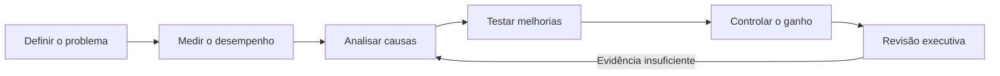

# DMAIC Ágil Suite
## Manual Executivo de Uso

**Versão:** 2.0  
**Idioma:** Português do Brasil  
**Público:** patrocinadores, donos de processo, Master Black Belts, Black Belts, Green Belts, Product Owners e Scrum Masters.

---

## 1. Objetivo executivo

O DMAIC Ágil Suite organiza decisões de melhoria contínua em um único workspace, combinando Lean Seis Sigma, DMAIC, ciclos curtos de trabalho e análises orientadas por dados.

A aplicação ajuda a liderança a responder quatro perguntas:

1. **Qual problema deve ser priorizado?**
2. **Quais evidências sustentam a decisão?**
3. **Qual mudança deve ser testada?**
4. **Como garantir que o ganho permaneça?**

A Suíte oferece uma primeira estrutura de trabalho. A decisão permanece com o time responsável pelo processo.

> Princípio de governança: nenhuma hipótese gerada pela Suíte deve ser tratada como causa confirmada sem evidência operacional ou estatística.

---

## 2. Resultado esperado

Ao concluir o ciclo, o workspace deve conter:

- problema e objetivo aprovados;
- Project Charter validado;
- voz do cliente traduzida em CTQs;
- indicador Y com definição operacional e baseline;
- processo representado em SIPOC;
- sistema de medição avaliado;
- causas e Xs vitais priorizados;
- hipóteses testadas;
- ações de melhoria com responsáveis;
- plano de controle e plano de reação;
- resultado comparado ao baseline;
- evidências de sustentação.

---

## 3. Papéis e decisões

| Papel | Responsabilidade executiva |
|---|---|
| Patrocinador | Remove barreiras, aprova prioridade e valida o resultado de negócio. |
| Dono do processo | Confirma o problema, a meta, as restrições e a sustentação do novo padrão. |
| Líder do projeto | Conduz o ciclo, registra decisões e garante a qualidade dos dados. |
| Time de melhoria | Investiga causas, testa soluções e atualiza os artefatos. |
| Especialista técnico | Apoia medição, análise estatística, tecnologia ou requisitos regulatórios. |

### Gate de decisão

Avance de fase somente quando houver uma resposta objetiva para a pergunta da fase e um responsável definido pela próxima ação.

---

## 4. Fluxo de gestão

### Visão das fases

| Fase | Pergunta de gestão | Evidência mínima |
|---|---|---|
| Definição | Estamos resolvendo o problema certo? | Charter, VOC/CTQ, Y e escopo. |
| Medição | O que os dados mostram? | Dados confiáveis, Pareto/I-MR e MSA. |
| Análise e melhoria | Qual causa deve ser tratada e como? | Hipótese, teste, solução e responsável. |
| Controle | O ganho está sustentado? | Resultado, controle, reação e padrão atualizado. |

---

## 5. Preparação do projeto

Antes de abrir o pipeline, reúna:

- problema observável e mensurável;
- processo ou unidade afetada;
- impacto operacional ou financeiro;
- período de ocorrência;
- indicador de resultado, se disponível;
- dados em CSV, quando aplicável;
- pessoas capazes de validar as hipóteses.

### Problem statement recomendado

> O tempo entre a entrada da solicitação e a aprovação do crédito varia de 8 a 31 minutos nas agências, gerando retrabalho e baixa previsibilidade no fechamento mensal.

Evite frases genéricas como “o processo está ruim”.

---

## 6. Execução na aplicação

### 6.1 Visão geral

Na tela inicial, revise:

- projeto ativo;
- problem statement;
- progresso das fases DMAIC;
- pulso do projeto;
- pendências principais;
- próximo passo recomendado.

O Problem Statement e o Project Charter ficam no bloco recolhível **Contexto do projeto**. A navegação é organizada em dois grupos: **Projeto** (Visão geral, Resumo executivo e Decisões) e **DMAIC** (Definição, Medição, Análise e Melhoria e Controle). As ferramentas ficam dentro das fases, reduzindo a competição entre método e etapa.

Cada fase apresenta um cabeçalho contextual fixo com objetivo, progresso, pendência principal e ação recomendada. O botão **Continuar em...** abre a próxima fase que ainda precisa de evidência.

Use o **Resumo executivo** para acompanhar problema, Y, baseline, hipóteses, ações abertas, alertas, resultado atual e a trilha de rastreabilidade da causa ao resultado. O relatório executivo reúne também decisões, histórico e anexos registrados.

### 6.2 Charter

Preencha ou revise:

- nome e área do projeto;
- líder e patrocinador;
- objetivo;
- histórico e business case;
- definição da meta;
- KPIs;
- escopo incluído e excluído;
- equipe;
- valor esperado para o negócio;
- informações financeiras coletadas.

O Charter é preenchido em cinco etapas recolhíveis: Contexto; Meta e escopo; Cliente e VOC; Equipe; Valor financeiro. Salve usando **Salvar no Repositório** antes de iniciar o pipeline.

### 6.3 Pipeline da Suíte

1. confirme o problem statement;
2. clique em **Iniciar pipeline**;
3. aguarde a conclusão;
4. revise todos os artefatos;
5. corrija o conteúdo com o time;
6. salve as decisões relevantes.

A chave da Suíte deve permanecer configurada no servidor. Nunca a coloque no Charter, no CSV ou no código do navegador.

As sugestões e artefatos exibem estados de confiança: **Sugestão da Suíte**, **Editado pelo usuário**, **Validado**, **Aprovado** e **Desatualizado**. Esses estados distinguem autoria, revisão e aprovação; uma sugestão da Suíte não é uma decisão executiva.

---

## 7. Definição

**Decisão da fase:** o problema, o resultado esperado e o escopo estão alinhados?

Revise:

- Project Charter;
- VOC e CTQ;
- indicador Y;
- baseline e meta;
- SIPOC;
- dentro e fora do escopo;
- composição do time.

O indicador Y deve informar nome, definição operacional, unidade, frequência, fonte, baseline e meta.

---

## 8. Medição

**Decisão da fase:** quais fatores merecem investigação com base em dados?

Antes dos detalhes técnicos, a Suíte apresenta uma leitura executiva com: **o que foi observado**, **o que isso significa** e **qual decisão é recomendada**. As frases acionáveis acima dos gráficos orientam a conversa, mas não substituem o teste estatístico.

### MSA

Verifique repetibilidade, reprodutibilidade, status do Gage R&R e recomendação de uso. Não faça conclusões fortes com um sistema de medição não confiável.

### Pareto

Use um CSV com cabeçalho, categorias textuais e, quando disponível, uma coluna numérica. O Pareto ordena ocorrências e percentual acumulado. Avalie se a categoria “Outros” está grande demais e se a classificação foi consistente.

### I-MR

Use observações numéricas na ordem temporal. A carta ajuda a localizar pontos fora dos limites, deslocamentos e mudanças de estabilidade. Ela indica onde investigar; não prova a causa.

### Priorização

Use 6M, esforço x impacto e Xs vitais para selecionar poucas frentes de alto valor. Prioridade não é causalidade: a causa ainda precisa ser testada.

---

## 9. Análise e Melhoria

**Decisão da fase:** a solução foi testada e o novo padrão pode ser sustentado?

### Análise

Para cada hipótese, registre X, Y, teste, hipótese nula, resultado, decisão e evidência complementar. Considere tamanho da amostra, contexto operacional e relevância prática.

### Melhoria

Use experimentos pequenos e um plano 5W2H com What, Why, Where, When, Who, How e How much. Toda ação precisa de responsável, prazo e evidência de conclusão.

### Controle

Defina o que medir, frequência, responsável, limite, plano de reação, OCAP e Poka Yoke. O controle deve permitir detectar desvio e agir antes da perda do ganho.

---

## 10. Controle

Carregue o CSV pós-intervenção, selecione os indicadores e informe o período de coleta.

A fase começa pela leitura executiva do comportamento pós-intervenção. Ela resume a observação, o significado para a estabilidade e a decisão recomendada antes das cartas X-AM, tabelas e avaliação da Suíte.

A aplicação apresenta:

- carta X-AM;
- média, desvio padrão, mínimo e máximo;
- omissos e observações válidas;
- limites de controle;
- último valor e variação em relação à baseline;
- avaliação de sucesso;
- plano de sustentabilidade;
- eventual cálculo financeiro.

O ganho financeiro somente deve ser apresentado como valor confirmado quando houver volume, variação de eficiência, valor ou custo unitário, moeda e período.

Quando aplicável:

> ganho financeiro = volume operacional × (variação de eficiência em p.p. ÷ 100) × valor ou custo unitário

Sem algum componente, registre o dado ausente e não invente um valor.

Use **Salvar no Repositório** para persistir arquivo, indicadores, estatísticas, avaliação e plano de sustentabilidade. O CSV de Medição, o diagnóstico de Suíte e os resultados de Controle são restaurados ao reabrir o projeto. Exporte o relatório em PDF somente depois que os gráficos e a avaliação estiverem disponíveis.

---

## 11. Leitura executiva dos indicadores

O painel mostra o estado do workspace, não substitui uma reunião de decisão.

- **Dias no ciclo:** tempo desde a data do Charter.
- **Indicador Y:** baseline do pipeline ou estatística do CSV, quando disponível.
- **Vital Xs:** quantidade de Xs preenchidos e priorizados.
- **Confiança dos dados:** status informado pela avaliação MSA.
- **Progresso:** proporção de entregas concluídas em cada fase.

Quando não houver dados suficientes, o painel deve exibir ausência de informação. Não use valores de demonstração para aprovar decisões.

O topo da aplicação informa **Salvo agora** ou **Alterações não salvas**. O rascunho local é atualizado automaticamente, mas o salvamento manual no Repositório confirma a entrega para o time. Ao trocar de projeto com alterações pendentes, a aplicação solicita confirmação.

Quando não houver dados, a Suíte informa o que falta, por que é necessário e o formato mínimo esperado, com ação direta para resolver. Mapa de processo, Ishikawa e Plano de ação usam área ampla; Pareto e I-MR são ferramentas de inspeção rápida. Em telas menores, priorize a leitura executiva antes das tabelas e use os estados textuais de confiança, sem depender apenas de cores.

---

## 12. Critérios de qualidade

Antes de apresentar o projeto à liderança, confirme:

- [ ] problema aprovado pelo dono do processo;
- [ ] meta operacional definida;
- [ ] baseline rastreável;
- [ ] fonte e período dos dados registrados;
- [ ] medição avaliada;
- [ ] causas priorizadas com critério explícito;
- [ ] hipótese testada;
- [ ] ação com responsável e prazo;
- [ ] impacto comparado ao baseline;
- [ ] plano de reação definido;
- [ ] novo padrão documentado;
- [ ] resultado financeiro validado pelo responsável financeiro;
- [ ] Controle salvo;
- [ ] relatório exportado.

---

## 13. Privacidade e responsabilidade

- processe CSVs localmente sempre que possível;
- não inclua senhas, tokens ou dados pessoais desnecessários;
- não versione arquivos `.env`;
- mantenha a chave da Suíte no ambiente do servidor;
- trate conteúdo gerado pela Suíte como hipótese ou rascunho;
- valide decisões operacionais, financeiras, regulatórias e de segurança com os responsáveis.

---

## 14. Solução rápida de problemas

| Sintoma | Verificação |
|---|---|
| Pipeline não inicia | Problem statement, chave da Suíte, permissão do modelo e serviço. |
| CSV não é aceito | Extensão, cabeçalho, separador e valores válidos. |
| I-MR não aparece | Pelo menos duas observações numéricas em ordem. |
| Avaliação da Suíte ausente | Servidor, chave, variável selecionada e valores válidos. |
| Dados não reaparecem | Salvamento concluído e projeto correto carregado. |
| PDF incompleto | Aguarde gráficos e avaliação antes de exportar. |

---

## 15. Encerramento

Um projeto DMAIC Ágil está pronto para revisão executiva quando o time consegue demonstrar, com dados e responsáveis, qual problema foi tratado, qual mudança foi realizada, qual resultado foi obtido e como o ganho será sustentado.
